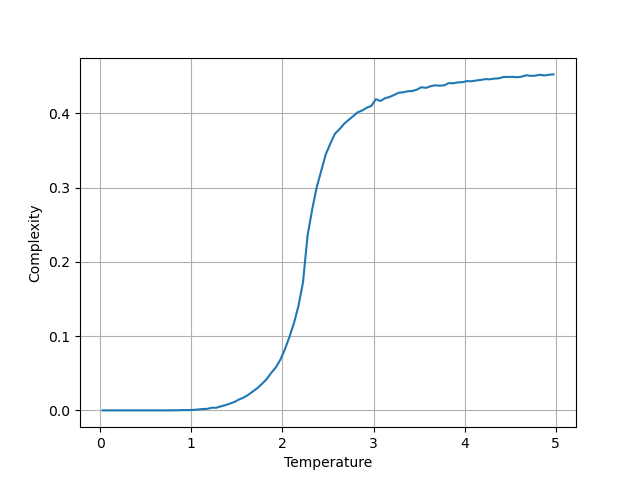
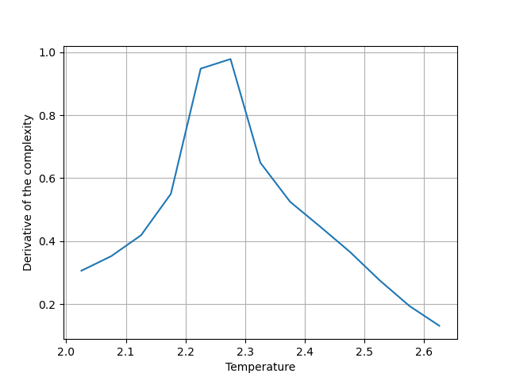

# Estimation of the Curie temperature using Structural Complexity in the Ising model

[Multiscale structural complexity of natural patterns](https://www.pnas.org/doi/10.1073/pnas.2004976117)

# Usage

## Prerequisite
- git
- make
- clang++
- python
- [numpy](https://pypi.org/project/numpy)
- [matplotlib](https://matplotlib.org/stable/install/index.html)

## Build

```bash
git clone https://github.com/moriar1/ising-complexity
cd ising-complexity
make
./bin/ising_complexity
python3 visualize.py
```

# Results example



